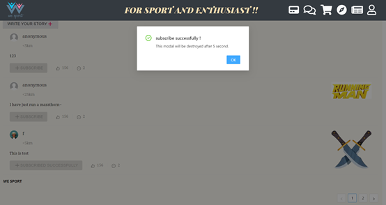
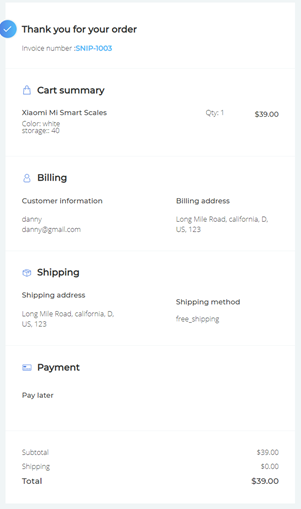

author: Gong Xiaofeng

## Features.

-  Authentication - The basic login/register functions

- remember me - local storage

- cookie - user will be granted with a cookie after successfully login

- forget password - using email to notify users to change password

- customized avatar- allow user to use their own icon

- accept distance - user can choose stories they wanna see with a slide bar

- write story - user can write story in text,image, audio and video, the system will record user's fuzzy location

- fuzzy location - the system will dim the user's location by truncating user's location

- anonymous - user can choose to be anonymous when writing story so that other user couldn't see your name and subscribe you

- nearby story - user can see their nearby stories within their accept distance

-  subscribe - user can subscribe other users, one-way subscribe will pop a notice while bidirectional subscription will pop up a "match" which enable users to chat.

- Page segmentation -  used for segmentation in nearby story page

- Menu bar - the bar is fixed on the top. If user scroll down it will appear while it would be invisible when user scroll up.

- upload images - the images will be stored in the database named as the timestamps

- chat - users that subscribed each other can chat in a delicate chat box with interesting images

- conversation list - all the conversations will be listed

- purchase - user can purchase products listed in the shop page

- item card - item card is equipped with regular operation buttons

- account - user can have a financial account used for purchasing items

- shipping - user can choose different ways of shipping with their current address

- payment - in the final process of purchasing , user can choose different ways to pay

- bill - user will get a bill of what they bought after transaction finished successfully

- Map - markers show different places and user location

- Cluster - markers will be clustered when user zoom out

- News - get latest news crawled from different websites implemented by News API

- Weather forecast - get a weather forecast for next 24 hours including thermos, humidity, wind

  ## Setup requirements

```bat
  npm install
  npm run build
  npm start
```

  customize your Google API key

  A key for email supports SMTP

  an openweather API key

  a News API key

  register a Snipcart account and configure your website
  
  register a ButterCMS account and manage your products
  
  A cypress account
  
  
  
  
  
  
  
  ## API Data Model.
  
  see backend: https://github.com/copyninnja/WE_back
  


  ## 	User Interface Design.

- Brand Image 


​												

- Login Page


- Find password Page


- Register Page

  

- Information Refine Page


- Menu Bar

  

- Story Page


- One way Subscribe user alert



- Two users subscribed each other

  

- Write Story Page


- Chat Page


- Chat with a specific person Page


- Shop Page


- My Account


- Financial account register


- Cart Summary


- Shipping

  

- Payment

  

- Invoice



- Map Page


- Weather 


- News


- Profile Page


